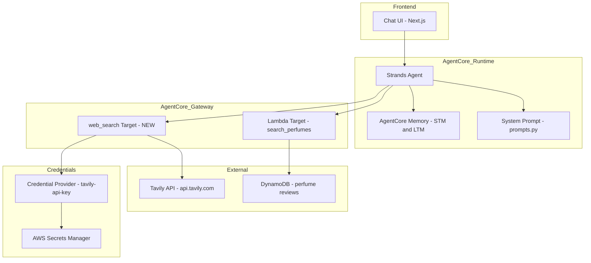
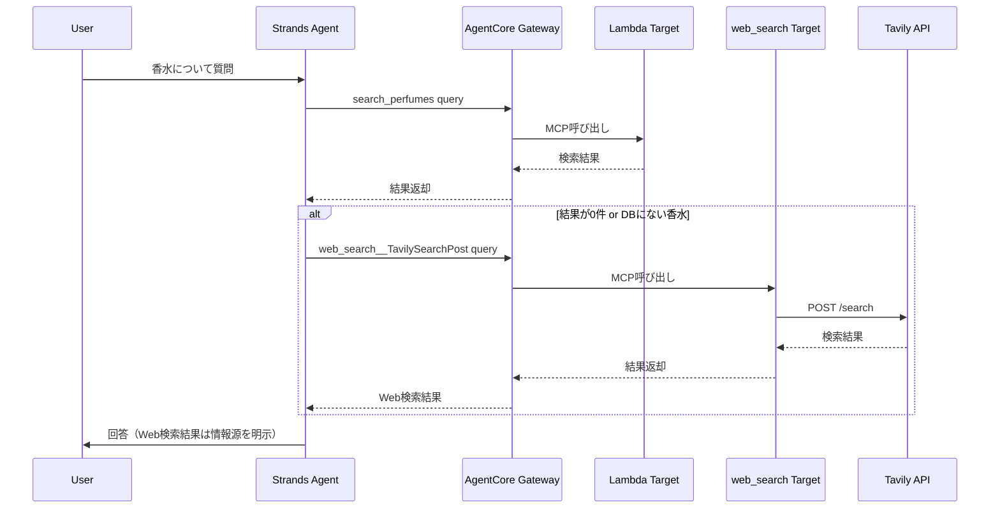

# Design Document: agentcore-web-search-tool

## Overview

**Purpose**: AgentCore GatewayにTavily Web検索ツールを統合し、Scenseiエージェントが実体験データベース（香水DB）にない香水情報をWeb検索で補完できるようにする。

**Users**: Scenseiエージェントが、ユーザーの質問に対してsearch_perfumesで該当データが見つからない場合にWeb検索を実行し、より幅広い香水情報を提供する。

**Impact**: 既存のAgentCore Gateway構成に新しいTavily統合ターゲットを追加し、システムプロンプトにWeb検索ガイドラインを追記する。エージェントのPythonコード変更は不要（MCPClientによる自動検出）。

### Goals
- Tavily APIキーをCredential Providerで安全に管理する
- AgentCore GatewayにTavily統合ターゲットを追加し、MCP経由でWeb検索ツールを公開する
- システムプロンプトでWeb検索の使用ガイドライン（優先度、クエリ作成、情報源明示）を定義する

### Non-Goals
- Tavily以外の検索プロバイダー（Google、Bing等）への対応
- 検索結果のキャッシング機構
- TavilySearchExtract（Webページ抽出）の利用（将来的に検討）
- エージェントPythonコードの変更

## Architecture

### Existing Architecture Analysis

現在のScenseiバックエンドアーキテクチャ:

| コンポーネント | 状態 | 役割 |
|--------------|------|------|
| AgentCore Runtime | 稼働中 | Strands Agentホスティング（`scensei-xajQ0R77kv`） |
| AgentCore Gateway | 稼働中 | MCP経由ツール公開（`scenseigateway-*`） |
| Lambda Target | 稼働中 | 香水DB検索（`search_perfumes`） |
| MCPClient | 実装済み | IAM認証でGateway接続、`list_tools_sync()`でツール自動検出 |
| AgentCore Memory | 稼働中 | STM + LTM（preferences / facts / summaries） |

**統合ポイント**:
- 既存Gatewayに新規Targetを追加するのみ（破壊的変更なし）
- MCPClientの`list_tools_sync()`が新ツールを自動検出するため、`app.py`や`scensei_agent.py`の変更不要
- 変更対象はシステムプロンプト（`prompts.py`）のみ

### Architecture Pattern & Boundary Map



**Architecture Integration**:
- Selected pattern: Gateway統合パターン（既存パターン踏襲）
- Domain boundaries: AgentCore Gateway内でツール境界を維持、新規Target追加のみ
- Existing patterns preserved: MCPプロトコル、IAM認証、Credential Provider、ストリーミング応答
- New components rationale: `web_search` Targetは外部Web検索へのゲートウェイ。Credential Providerは既存パターンに沿ったAPIキー管理
- Steering compliance: tech.mdの「AgentCore for AI Backend」方針に準拠

### Technology Stack

| Layer | Choice / Version | Role in Feature | Notes |
|-------|------------------|-----------------|-------|
| Backend | Strands Agents >=1.23.0 | エージェントフレームワーク | 変更なし |
| Gateway | AgentCore Gateway | MCP経由ツール公開 | web_search Target追加 |
| Credential | AgentCore Credential Provider | APIキー管理 | CLI経由で作成 |
| External | Tavily API (`api.tavily.com`) | Web検索サービス | TavilySearchPost |
| Config | `prompts.py` | システムプロンプト | ガイドライン追記 |

## System Flows

### Web検索フロー



**Key Decisions**:
- 香水DB（search_perfumes）を先に検索し、結果がない場合のみWeb検索を実行
- 検索優先度はシステムプロンプトで制御（LLMの判断に委任）
- Web検索結果を含める場合は「Webで調べたところ」等の前置きで情報源を明示

## Requirements Traceability

| Requirement | Summary | Components | Interfaces | Flows |
|-------------|---------|------------|------------|-------|
| 1.1-1.4 | Credential Provider登録 | CredentialProvider | CLI Command | セットアップ |
| 2.1-2.4 | Gateway Target設定 | web_search Target | Console Config | セットアップ |
| 3.1-3.3 | エージェントツール利用 | MCPClient（既存） | list_tools_sync | Web検索フロー |
| 4.1-4.4 | 検索優先度とフォールバック | SystemPrompt | - | Web検索フロー |
| 5.1-5.3 | システムプロンプト更新 | SystemPrompt | - | - |

## Components and Interfaces

| Component | Domain/Layer | Intent | Req Coverage | Key Dependencies | Contracts |
|-----------|--------------|--------|--------------|------------------|-----------|
| CredentialProvider | Infrastructure | Tavily APIキーの安全な管理 | 1.1-1.4 | AWS CLI (P0) | CLI |
| web_search Target | Infrastructure | Gateway統合ターゲット | 2.1-2.4 | CredentialProvider (P0), Console (P0) | Console |
| SystemPrompt | Agent | Web検索ガイドラインの定義 | 3.1-3.3, 4.1-4.4, 5.1-5.3 | prompts.py (P0) | Config |

### Infrastructure Layer

#### Credential Provider

| Field | Detail |
|-------|--------|
| Intent | Tavily APIキーをAWS Secrets Manager経由で安全に保存・管理 |
| Requirements | 1.1, 1.2, 1.3, 1.4 |

**Responsibilities & Constraints**
- APIキーの暗号化保存（Secrets Manager自動連携）
- Gateway Targetからの参照を許可
- credentialProviderArnによる識別

**Dependencies**
- External: AWS CLI `bedrock-agentcore-control` — Credential Provider作成 (P0)
- External: AWS Secrets Manager — キー暗号化保存 (P0)

**Contracts**: CLI [x]

##### CLI Command

```bash
aws bedrock-agentcore-control create-api-key-credential-provider \
  --name tavily-api-key \
  --api-key "${TAVILY_API_KEY}" \
  --region ap-northeast-1
```

出力:
```json
{
  "credentialProviderArn": "arn:aws:acps:ap-northeast-1:ACCOUNT:token-vault/.../apikeycredentialprovider/tavily-api-key",
  "apiKeySecretArn": {
    "secretArn": "arn:aws:secretsmanager:ap-northeast-1:ACCOUNT:secret/..."
  },
  "name": "tavily-api-key"
}
```

**Implementation Notes**
- Integration: 一度きりの設定操作。`credentialProviderArn`をメモしてGateway Target設定で使用
- Validation: APIキーの有効性はTavily API呼び出し時に検証される
- Risks: APIキーの漏洩 → 環境変数経由で渡し、コマンド履歴に残さない工夫が必要

---

#### web_search Target

| Field | Detail |
|-------|--------|
| Intent | AgentCore GatewayにTavily統合ターゲットを追加し、MCP経由でWeb検索ツールを公開 |
| Requirements | 2.1, 2.2, 2.3, 2.4 |

**Responsibilities & Constraints**
- Tavily APIへのリクエスト転送
- MCP経由でTavilySearchPostツールを公開
- Credential Providerを参照してAPIキー認証

**Dependencies**
- Inbound: AgentCore Gateway — ターゲット登録 (P0)
- Outbound: Tavily API (`api.tavily.com`) — Web検索 (P0)
- External: CredentialProvider `tavily-api-key` — APIキー参照 (P0)

**Contracts**: Console [x]

##### Console Configuration

> **重要**: Tavily統合ターゲットはAWS Management Console経由でのみ追加可能。CLI/APIでは作成不可。

**セットアップ手順**:
1. AWS Management Console → Amazon Bedrock → AgentCore → Gateway
2. 既存Gateway（`scenseigateway-*`）を選択
3. 「Targets」タブ →「Add Target」
4. 「Integration」を選択
5. 設定:
   - **Target Name**: `web_search`
   - **Provider**: Tavily
   - **Credential Provider**: `tavily-api-key`（事前作成済み）
6. 「Add Target」で保存

**公開されるツール**:

| MCP公開名 | REST API | 説明 |
|----------|----------|------|
| `web_search__TavilySearchPost` | POST /search | Web検索実行 |
| `web_search__TavilySearchExtract` | POST /extract | Webページ抽出（今回スコープ外） |

**確認方法**:
```python
with mcp_client:
    tools = mcp_client.list_tools_sync()
    for tool in tools:
        print(tool.name)
# 期待される出力:
# - search_perfumes (既存)
# - web_search__TavilySearchPost (新規)
# - web_search__TavilySearchExtract (新規)
```

**Implementation Notes**
- Integration: コンソール操作が必須。手順をドキュメント化して再現性を担保
- Validation: `list_tools_sync()`で公開ツールを確認
- Risks: 手動設定のため、環境再構築時の再現性 → セットアップ手順書で対応

---

### Agent Layer

#### System Prompt Update

| Field | Detail |
|-------|--------|
| Intent | Web検索ツールの使用ガイドライン（使用タイミング、クエリ作成、情報源明示）を追加 |
| Requirements | 3.1, 3.2, 3.3, 4.1, 4.2, 4.3, 4.4, 5.1, 5.2, 5.3 |

**Responsibilities & Constraints**
- 検索優先度ロジックの定義（search_perfumes優先、Web検索は補完）
- 検索クエリ作成ガイドライン（具体的なブランド名・商品名を含める）
- 情報源明示ルール（Web検索結果には前置きを付ける）
- エラー時のフォールバック指示（LLMの知識で回答）

**Dependencies**
- Inbound: Strands Agent — プロンプト読み込み (P0)

**Contracts**: Config [x]

##### Prompt Addition

`agentcore/src/agent/prompts.py` の `SCENSEI_SYSTEM_PROMPT` 末尾（`それでは会話を始めましょう。`の直前）に以下を追加:

```
## Web検索の使い方

web_search__TavilySearchPost ツールは、あなたの経験にない香水の情報をWebから取得するために使用します。

【使用タイミング】
- search_perfumes で該当する香水が見つからなかった場合
- お客様が具体的なブランド・商品名を挙げてきたが、あなたの経験にない場合
- 最新の香水情報が必要な場合

【検索のコツ】
- 「香水名 ブランド名 レビュー」のように具体的に検索
- 「香水 おすすめ」のような一般的な検索は避ける
- 英語の香水名はそのまま検索

【重要な注意】
- Web検索結果は参考情報として扱う
- あなたの実体験データがある場合はそちらを優先
- 検索結果を鵜呑みにせず、信頼性を確認してから伝える
- Web検索で得た情報を伝える際は「Webで調べたところ」「一般的な情報によると」と前置きする

【検索例】
- 「CHANEL No.5について教えて」→ web_search__TavilySearchPost(query="CHANEL No.5 perfume review")
- 「Diorの新作香水」→ web_search__TavilySearchPost(query="Dior new perfume 2026")
```

**Implementation Notes**
- Integration: `SCENSEI_SYSTEM_PROMPT` の末尾に追加。既存プロンプト構造を維持
- Validation: AgentCore Runtimeにデプロイ後、実際の会話でツール使用を確認
- Risks: プロンプト長の増加 → 現在のプロンプトは約2000トークン、追加分は約300トークン。Claude Haiku 4.5のコンテキスト長に対して十分な余裕あり

## Data Models

### Data Contracts & Integration

**Tavily Search Request** (Gateway経由で自動変換):

```python
# web_search__TavilySearchPost パラメータ
class TavilySearchParams:
    query: str           # 検索クエリ（必須）
    search_depth: str    # "basic" | "advanced" (デフォルト: "basic")
    max_results: int     # 結果件数（デフォルト: 5）
    include_answer: bool # AI生成回答を含めるか（デフォルト: False）
```

**Tavily Search Response**:

```python
class TavilySearchResult:
    query: str
    answer: str | None          # AI生成の回答サマリー
    results: list[dict]         # 各結果: title, url, content, score
```

> パラメータはGateway経由で自動的にTavily REST APIに変換される。エージェントはMCPツールとして `query` パラメータを指定するのみ。

## Error Handling

### Error Strategy

| エラー種別 | 対応 |
|-----------|------|
| Tavily API障害 | エージェントがLLMの知識で回答（プロンプトで指示） |
| レート制限 | Gateway側で自動リトライ（AgentCore標準動作） |
| 無効なAPIキー | Gateway接続エラー → ツールなし状態でフォールバック動作 |
| Gateway未接続 | `app.py`の既存フォールバック（ツールなしで動作） |

エラー時の挙動はすべて既存の`app.py`フォールバックパターン（Gateway未接続時はツールなしで実行）に準拠。

## Testing Strategy

### Integration Tests
1. Credential Provider作成確認（CLI出力でARN取得）
2. Gateway Target追加確認（コンソールでステータス確認）
3. `list_tools_sync()`で`web_search__TavilySearchPost`が一覧に含まれることを確認
4. 実際のWeb検索実行テスト（`query="CHANEL No.5"`）

### E2E Tests（手動確認）
1. DBにある香水（例：「おすすめの香水」）→ search_perfumes結果を優先して回答
2. DBにない香水（例：「シャネル No.5について教えて」）→ Web検索で補完して回答
3. Web検索結果を含む回答で情報源が明示されていること
4. Tavily APIエラー時 → LLMの知識で回答（フォールバック）

## Security Considerations

- **APIキー管理**: Credential Provider + Secrets Managerで暗号化保存。ソースコードに含めない
- **通信**: Gateway経由でIAM認証、HTTPS通信
- **データ保持**: Tavily APIのクエリデータはTavily側のポリシーに準拠

## Supporting References

詳細な調査結果は [research.md](./research.md) を参照:
- ツール命名規則（`${target_name}__${tool_name}`）
- Credential Provider CLIの正確なシンタックス
- Tavily統合方式の調査結果

外部ドキュメント:
- [AgentCore Gateway Target Integrations](https://docs.aws.amazon.com/bedrock-agentcore/latest/devguide/gateway-target-integrations.html)
- [create-api-key-credential-provider CLI](https://docs.aws.amazon.com/cli/latest/reference/bedrock-agentcore-control/create-api-key-credential-provider.html)
- [Strands Agents MCP Tools](https://strandsagents.com/latest/documentation/docs/user-guide/concepts/tools/mcp-tools/)
- [Tavily API Documentation](https://docs.tavily.com/)
