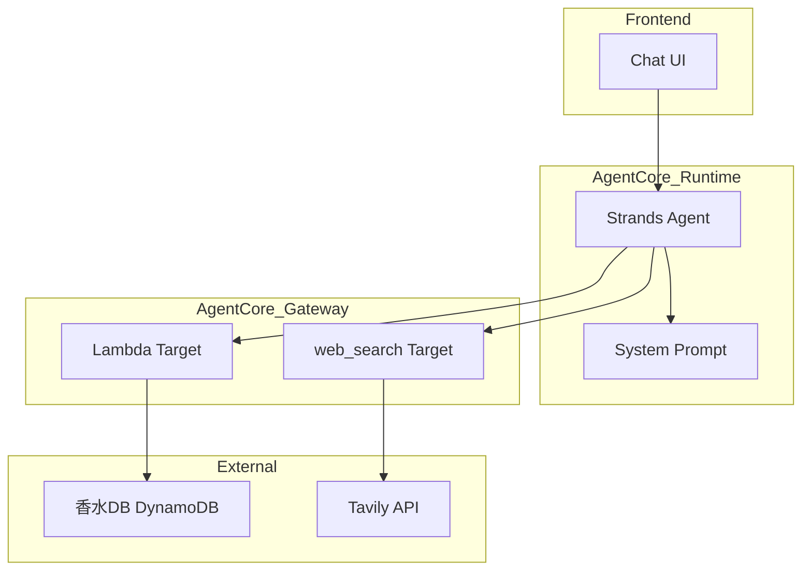
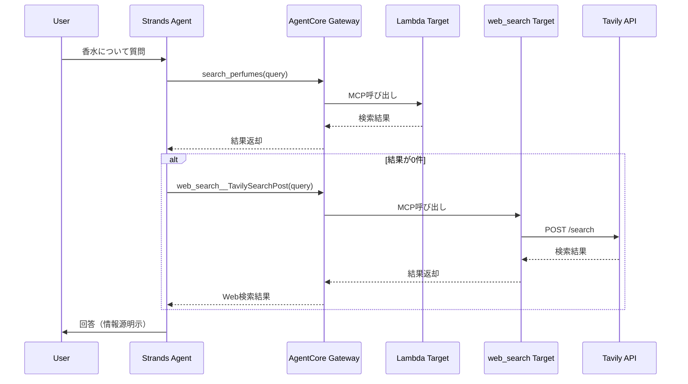

# Technical Design: Web Search Tavily Integration

## Overview

**Purpose**: Tavily Web検索をAgentCore Gateway経由でエージェントから利用可能にし、実体験データベース（香水DB）にない香水情報を補完する機能を提供する。

**Users**: Scenseiエージェントおよび開発者がこの機能を利用し、ユーザーへの香水情報提供の幅を拡大する。

**Impact**: 既存のAgentCore Gateway構成にTavily統合ターゲットを追加し、システムプロンプトを更新することで、エージェントの回答品質を向上させる。

### Goals
- Tavily APIキーをCredential Providerで安全に管理
- AgentCore GatewayにTavily統合ターゲットを追加
- エージェントがMCP経由でWeb検索ツールを利用可能にする
- 実体験データ優先、Web検索で補完する検索優先度ロジックを実現

### Non-Goals
- Tavily以外の検索プロバイダー（Google、Bing等）への対応
- 検索結果のキャッシング機構
- 検索クエリのログ保存・分析機能
- APIエラー時の高度なフォールバック機構（後回し）

---

## Architecture

### Existing Architecture Analysis

現在のScenseiアーキテクチャ:

| コンポーネント | 状態 | 役割 |
|--------------|------|------|
| AgentCore Runtime | 稼働中 | Strands Agentホスティング |
| AgentCore Gateway | 稼働中 | MCP経由ツール公開 |
| Lambda Target | 稼働中 | 香水DB検索（search_perfumes） |
| MCPClient | 実装済み | Gateway接続・ツール取得 |

**統合ポイント**:
- 既存Gatewayに新規Targetを追加（破壊的変更なし）
- システムプロンプト（`prompts.py`）の拡張
- エージェントコード変更不要（MCPで自動検出）

### Tool Naming Convention

AgentCore Gatewayのツール名は以下のパターンで構成される:

```
${target_name}__${tool_name}
```

本設計での命名:
| Target名 | Tavily提供ツール | MCP公開名 |
|---------|-----------------|----------|
| `web_search` | `TavilySearchPost` | `web_search__TavilySearchPost` |
| `web_search` | `TavilySearchExtract` | `web_search__TavilySearchExtract` |

### Architecture Pattern & Boundary Map



**Architecture Integration**:
- Selected pattern: Gateway統合パターン（既存パターン踏襲）
- Domain boundaries: AgentCore Gateway内でツール境界を維持
- Existing patterns preserved: MCPプロトコル、IAM認証、Credential Provider
- New components rationale: web_search Targetは外部Web検索へのゲートウェイ
- Steering compliance: tech.mdのAgentCore活用方針に準拠

### Technology Stack

| Layer | Choice / Version | Role in Feature | Notes |
|-------|------------------|-----------------|-------|
| Backend | Strands Agents 1.23+ | エージェントフレームワーク | 変更なし |
| Gateway | AgentCore Gateway | MCP経由ツール公開 | web_search Target追加 |
| Credential | AgentCore Credential Provider | APIキー管理 | CLI経由で作成 |
| External | Tavily API | Web検索サービス | search_depth=basic |
| Config | prompts.py | システムプロンプト | 更新 |

---

## System Flows

### Web検索フロー



**Key Decisions**:
- 香水DBを先に検索し、結果がない場合のみWeb検索を実行
- Web検索結果を含める場合は情報源を明示
- 検索優先度はシステムプロンプトで制御（LLMに委任）

---

## Requirements Traceability

| Requirement | Summary | Components | Interfaces | Flows |
|-------------|---------|------------|------------|-------|
| 1.1-1.4 | Credential Provider登録 | CredentialProvider | CLI Command | Setup |
| 2.1-2.5 | Gateway Target設定 | web_search Target | Console Config | Setup |
| 3.1-3.4 | エージェントツール利用 | StrandsAgent | MCPClient | Web検索フロー |
| 4.1-4.4 | 検索優先度とフォールバック | SystemPrompt | - | Web検索フロー |
| 5.1-5.4 | システムプロンプト更新 | SystemPrompt | - | - |

---

## Components and Interfaces

### Summary

| Component | Domain/Layer | Intent | Req Coverage | Key Dependencies | Contracts |
|-----------|--------------|--------|--------------|------------------|-----------|
| CredentialProvider | Infrastructure | Tavily APIキー管理 | 1.1-1.4 | AWS CLI (P0) | CLI |
| web_search Target | Infrastructure | Gateway統合ターゲット | 2.1-2.5 | CredentialProvider (P0), Console (P0) | Console |
| SystemPrompt | Agent | Web検索ガイドライン | 4.1-4.4, 5.1-5.4 | prompts.py (P0) | Config |

---

### Infrastructure Layer

#### Credential Provider

| Field | Detail |
|-------|--------|
| Intent | Tavily APIキーをセキュアに保存・管理 |
| Requirements | 1.1, 1.2, 1.3, 1.4 |

**Responsibilities & Constraints**
- APIキーの暗号化保存
- Gateway Targetからの参照を許可
- ARNによる識別

**Dependencies**
- Outbound: AWS Secrets Manager — キー保存 (P0)

**Contracts**: CLI [x]

##### CLI Command
```bash
aws bedrock-agentcore-control create-api-key-credential-provider \
  --name tavily-api-key \
  --api-key "${TAVILY_API_KEY}" \
  --description "Tavily search API integration for Scensei"
```

**Output**:
```json
{
  "arn": "arn:aws:bedrock-agentcore:ap-northeast-1:ACCOUNT:credential-provider/tavily-api-key",
  "name": "tavily-api-key"
}
```

**Implementation Notes**
- Integration: 一度きりの設定、再実行不要
- Validation: APIキーの有効性はTavily側で検証
- Risks: APIキーの漏洩リスク → 環境変数経由で渡す

---

#### web_search Target

| Field | Detail |
|-------|--------|
| Intent | AgentCore GatewayにTavily統合を追加 |
| Requirements | 2.1, 2.2, 2.3, 2.4, 2.5 |

**Responsibilities & Constraints**
- Tavily APIへのリクエスト転送
- MCP経由でツールを公開
- Credential Providerを参照

**Dependencies**
- Inbound: AgentCore Gateway — ターゲット登録 (P0)
- Outbound: Tavily API — Web検索 (P0)
- External: CredentialProvider — APIキー参照 (P0)

**Contracts**: Console [x]

##### Gateway Configuration（コンソール経由のみ）

> **重要**: Tavily統合ターゲットはAWS Management Console経由でのみ追加可能。CLI/APIでは作成不可。

**セットアップ手順**:
1. AWS Management Console → Amazon Bedrock → AgentCore → Gateway
2. 既存Gateway（`scenseigateway-*`）を選択
3. 「Targets」タブ →「Add Target」
4. 「Integration」を選択
5. 設定:
   - **Target Name**: `web_search`
   - **Provider**: Tavily
   - **Credential Provider**: `tavily-api-key`（事前作成済み）
6. 「Add Target」で保存

**公開されるツール**:
| MCP公開名 | 説明 | 用途 |
|----------|------|------|
| `web_search__TavilySearchPost` | Web検索実行 | 香水情報検索 |
| `web_search__TavilySearchExtract` | Webページ抽出 | 詳細情報取得（オプション） |

**確認方法**:
```python
# MCPClientでツール一覧を確認
with mcp_client:
    tools = mcp_client.list_tools_sync()
    for tool in tools:
        print(tool.name)
# 期待される出力:
# - search_perfumes (既存)
# - web_search__TavilySearchPost (新規)
# - web_search__TavilySearchExtract (新規)
```

**Implementation Notes**
- Integration: コンソール操作が必須（CLI/API不可）
- Validation: `tools/list`で公開ツール確認
- Risks: 手動設定のため再現性に注意 → 手順をドキュメント化

---

### Agent Layer

#### System Prompt Update

| Field | Detail |
|-------|--------|
| Intent | Web検索ツールの使用ガイドラインを追加 |
| Requirements | 4.1, 4.2, 4.3, 4.4, 5.1, 5.2, 5.3, 5.4 |

**Responsibilities & Constraints**
- 検索優先度ロジックの定義（DB優先）
- 検索クエリ作成ガイドライン
- 情報源明示ルール

**Dependencies**
- Inbound: StrandsAgent — プロンプト読み込み (P0)

**Contracts**: Config [x]

##### Prompt Addition

**追加するセクション** (`agentcore/src/agent/prompts.py`):

```python
## Web検索の使い方

web_search__TavilySearchPost ツールは、あなたの経験にない香水の情報をWebから取得するために使用します。

【使用タイミング】
- search_perfumes で該当する香水が見つからなかった場合
- お客様が具体的なブランド・商品名を挙げてきたが、あなたの経験にない場合
- 最新の香水情報が必要な場合

【検索のコツ】
- 「香水名 ブランド名 レビュー」のように具体的に検索
- 「香水 おすすめ」のような一般的な検索は避ける
- 英語の香水名はそのまま検索

【重要な注意】
- Web検索結果は参考情報として扱う
- あなたの実体験データがある場合はそちらを優先
- 検索結果を鵜呑みにせず、信頼性を確認してから伝える
- Web検索で得た情報を伝える際は「Webで調べたところ」「一般的な情報によると」と前置きする

【検索例】
- 「CHANEL No.5について教えて」→ web_search__TavilySearchPost(query="CHANEL No.5 香水 レビュー")
- 「Diorの新作香水」→ web_search__TavilySearchPost(query="Dior 新作 香水 2026")
```

**Implementation Notes**
- Integration: `SCENSEI_SYSTEM_PROMPT`の末尾に追加
- Validation: エージェントの動作テストで確認
- Risks: プロンプト長の増加 → トークン制限に注意

---

## Data Models

### Data Contracts & Integration

**Tavily Search Request**:
```typescript
interface TavilySearchRequest {
  query: string;           // 検索クエリ
  search_depth?: 'basic' | 'advanced' | 'fast';  // デフォルト: basic
  max_results?: number;    // デフォルト: 5
  include_answer?: boolean;  // AI生成回答を含める
}
```

**Tavily Search Response**:
```typescript
interface TavilySearchResponse {
  query: string;
  answer?: string;         // AI生成の回答サマリー
  results: Array<{
    title: string;
    url: string;
    content: string;       // スニペット
    score: number;         // 関連度スコア
  }>;
}
```

---

## Error Handling

### Error Strategy

| エラー種別 | 対応 |
|-----------|------|
| Tavily API障害 | LLMの知識で回答（自動） |
| レート制限 | 一定時間待機後リトライ |
| 無効なAPIキー | 設定エラーとしてログ出力 |

> **Note**: 高度なフォールバック機構は後回し。基本的な動作確認を優先。

### Monitoring
- Tavily API呼び出し回数のCloudWatch監視（将来）

---

## Testing Strategy

### Integration Tests
1. Credential Provider作成確認（CLI）
2. Gateway Target追加確認（コンソール）
3. `tools/list`で`web_search__TavilySearchPost`確認
4. 実際の検索実行テスト

### E2E Tests
1. 「シャネル No.5について教えて」→ Web検索実行確認
2. DBにある香水 → DB結果優先確認
3. DBにない香水 → Web検索で補完確認

---

## Security Considerations

- **APIキー管理**: Credential Providerで暗号化保存、ソースコードに含めない
- **通信**: Gateway経由でIAM認証、HTTPS通信
- **データ保持**: Tavily APIは検索クエリを保存しない（SOC 2 Type II準拠）

---

## Supporting References

詳細な調査結果は [research.md](./research.md) を参照:
- ツール命名規則（`${target_name}__${tool_name}`）
- Tavily統合方式の比較
- Search APIパラメータ詳細
- Credential Provider作成コマンド

外部ドキュメント:
- [AgentCore Gateway Tool Naming](https://docs.aws.amazon.com/bedrock-agentcore/latest/devguide/gateway-tool-naming.html)
- [Gateway Target Integrations](https://docs.aws.amazon.com/bedrock-agentcore/latest/devguide/gateway-target-integrations.html)
- [Tavily API Documentation](https://docs.tavily.com/)
